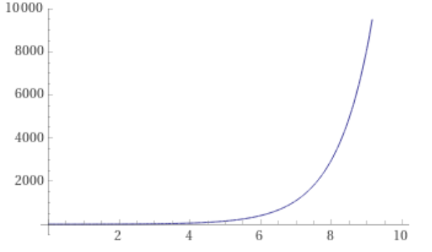

:cpp: C++
:stem: latexmath

= Differential privacy on Genomic data
Christos Chatzifountas  <christos.chatzifountas@yahoo.gr>

== Differential privacy AKA how to protect individuals
Our main purpose is to be able to draw information from a database of genomes
(Haplotypes) and at the same time, protecting individuals from exposure and.
Differential privacy builds conceptually on a method known as https://en.wikipedia.org/wiki/Randomized_response#:~:text=A%20person%20is%20asked%20if,coin%20or%20their%20true%20experience[randomized response].
The key idea is that when introducing https://en.wikipedia.org/wiki/Additive_noise_mechanisms[mechanisms that add noise] to the output of a query, private information
is hidden (because is noisy)  but more general information, like mean values and
standard deviation is preserved

The idea of  Randomized response  was a common technique applied
to surveys <<biz>> and is prior of Differential privacy. Differential Privacy is more involved and suited to modern
complex database and statistical methods. The reader can find  more information https://www.cis.upenn.edu/~aaroth/Papers/privacybook.pdf[here]
But for the purposes of this blog we will at  least need the following defintions

Let stem:[X] and  stem:[X'] be two databases that differ only in one element (row/record , we call them neigboors)
then a selection algorithm or query  stem:[\mathcal{M}] with set of all possible output values  stem:[S]
is said to be Differentialy Private if and only if for any stem:[s \in S]

[stem]
++++
Pr[\mathcal{M}(X) = s]  \leq e^\epsilon Pr[\mathcal{M}(X') = s]
++++
Today we know a lot of mechanism that are Differentialy private, the most common ones are
the Randomized response , the Laplace and the exponential mechanism.
From theese only the exponential mechanism is important to us, because it allows us to
select elements when it is impossible to directly add noise to the output of a
query, if for example the query has not a  numerical  output

Let stem:[D] be a set of database, that we want to extract information in a private manner and
stem:[\mathcal{R}] the set of outputs to a query (that might not be numerical in nature). Also assume that we have
stem:[u:D \times \mathcal{R} \rightarrow \mathbb{R}]  a "scoring mechanism" that we refer as the "utility function".
One can think the utility function as a way to assing a score to query output and  measure its significance,
even if the query whatever the query might return.

If stem:[\Delta u]  is the maximum absolute difference that any two neigboor database  can have then

The exponential mechanism is just to select an stem:[r\in \mathcal{R}]  with probability proportional to  stem:[e^(\frac{\epsilon u(x,r) } {2\Delta u})]

The quantity   stem:[\Delta u]  is super important. The intuition behind is that we do not want to select an element very outside of
the scope of the query and stem:[\Delta u]  prohibits us from doing exactly that

That will be enough to digest for now. There is also one last tool, the composition theorem, that we will not introduce formally.
It suffice to say that when one makes differentially private queries in succession, the result is also preserves privacy.

The reader should at least
keep in mind two things: We need to add noise to Haplotype selection. The way to do that is via the exponential mechanism.

== Defining utility for a Haplotype

A Haplotype is collection of "words" like GFAG GTAFG etc etc. We want to select words and make them available for statistical analysis, without
making available information with respect of the Haplotype.
The first thing to avoid is picking rare individuals, because theese are almost surely uniquely identified in the haplotype.
We also know that unicq individuals are very dense, almost all words in a haplotype is unique.

In essense we need to
1.) Select individual words that have non zero frequency
2.) Protect the privacy of the individual
We expect that very frequent individuals are not many either. For now we keep it simply
and create a utility function based only the frequency of the words in a Haplotype.

Let stem:[\mathcal{R}] be the non negative integers. If  stem:[ H  ] is the set of all words in a Haplotype  then stem:[\phi: H \rightarrow \mathcal{R} ]
is the function that represents the number of appearances of a word in that haplotype.
We define the utility function stem:[u(s,r): H \times \mathcal{R} \rightarrow [0, +\infty)  ] as follows: stem:[u(s,r) = r] iff stem:[\phi(s) = r  ]  and  stem:[u(s,r) = 0] otherwise

There are other variations of utility functions we could choose. For example instead of stem:[\phi(r)]  we could have similar behaviour with
stem:[\log (\phi(r) )], or we could take into account and incorporate the size of the word and get a little better selection of long words, but
having stem:[\phi(r)]  is a bit more convenient since stem:[\Delta[u] = 1] since if neighbors databases (collection of words) differ in one word, the different in frequency
is either 0 or 1.

Now we can collect words from the Haplotype and preserving privacy at the same time

== The algorithm

Now that we have the utility function we will procced  according to the principles of Exponential mechanism.
That is, we will aswear the  queries, in essense with approximating sampling from  stem:[Pr(s) = e^{\tfrac{\phi (r)   }{2}} ]
The sampling process will be iterative and the end result would be a set of words that constitute a synthetic database.

Observe that the sampling function

[stem]
++++
Pr(s) = e^{\tfrac{\phi (r)   }{2}}
++++

depicted below has a very very steep curve

That means, that sampling from it will give as haplotypes very close to the ones with the maximum frequency, most of the time
Previously we created a very involved wrapper around BGWTGRAPH -using SWIG- which is the de facto tool for manipulating
Haplotypes.

Thanks to SWIG we have used the  [red]#SearchState struct# methods [red]#size find# and [red]#extend# to
implement the following  function to racket

[source,racket]
----
(define (sample-single-state graph #:epsilon [ε  0.1] state)
  (define  state-list (map (λ (x)  (convert-void x)) (GRAPH-extend-to-valid-states graph state)))
  (define max-frequency (SearchState-size  (find-max-frequency state-list)))
  (define Δu  (log (/ max-frequency (+ 1 max-frequency))))
  (define utility (make-utility  ε Δu))
  (map (λ (x) (utility  (SearchState-size x))) state-list)
  (define calculated-utilities )
  (convert-void (car (sample-distribution calculated-utilities state-list 1))))
----

The [source,racket] (sample-distribution)  is also a custom  :cpp: function.

[bibliography]
== References

* [[[biz]]] Blair, Imai and Zhou. Design and Analysis of the Randomized Response Technique
